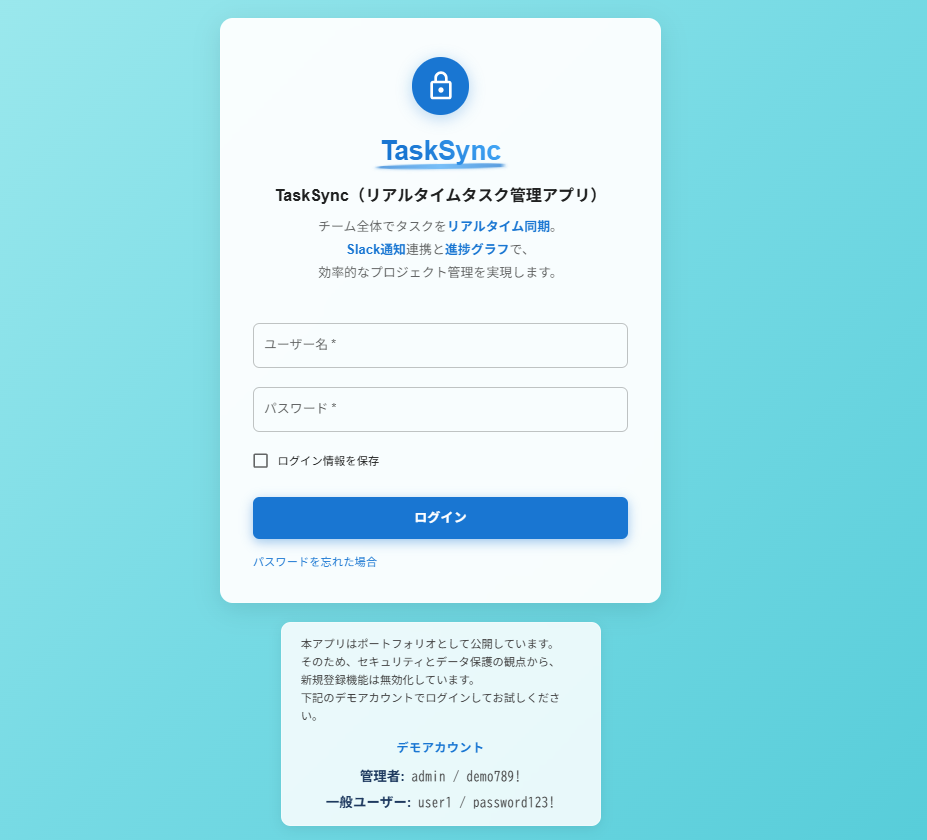
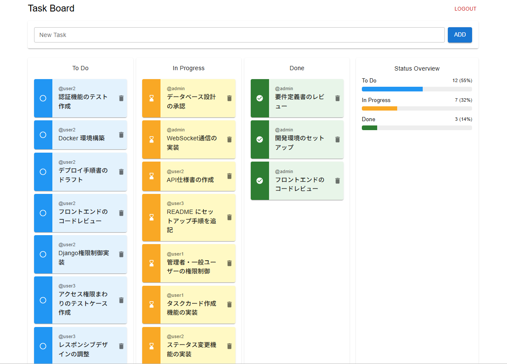
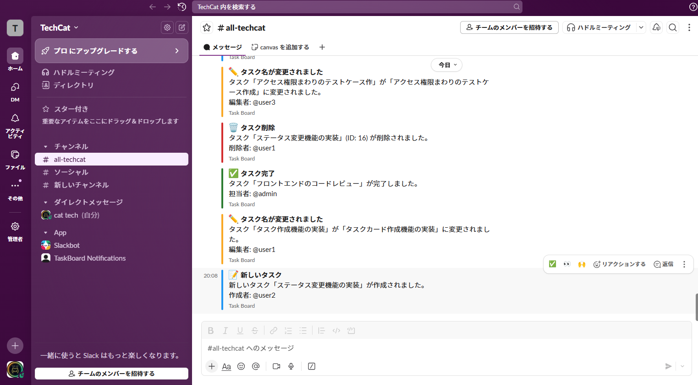
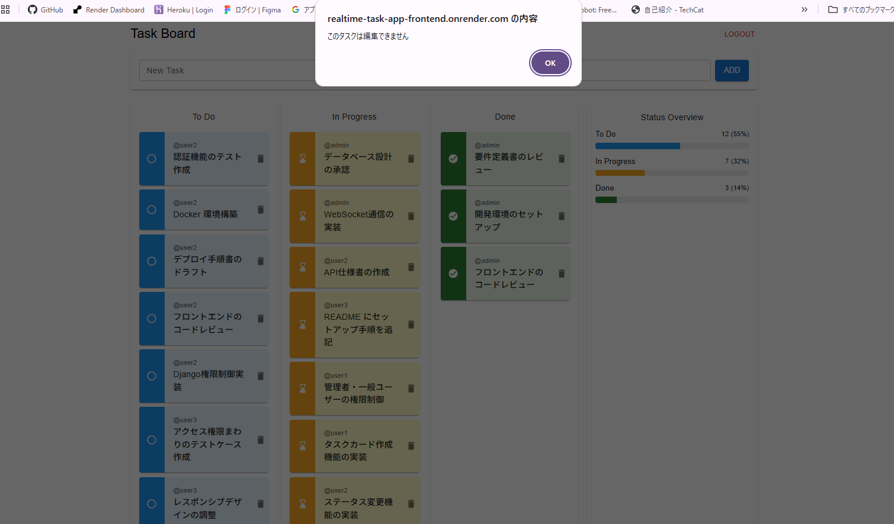

# TaskSync（リアルタイムタスク管理アプリ）

このアプリは、チーム向けのリアルタイム同期型タスク管理アプリです。   
複数ユーザーが同時にタスクボードを操作でき、変更が即座に全員の画面に反映されると同時に  
Slackによる通知機能も実装しています。

## 🌐 アプリURL（本番環境）

🔗 **https://realtime-task-app-frontend.onrender.com**

> バックエンドAPI: https://realtime-task-app-backend.onrender.com 


## 🎯 プロジェクト概要

このアプリケーションは、チームでのタスク管理を効率化するために開発しました。  
Trello を参考にしたカンバン方式の UI でドラッグ＆ドロップ操作が可能ですが、  
権限管理や操作ルールを独自に実装しており、ユーザーごとにできる操作が明確に制御されている点が特徴です。

### 主な特徴

- **リアルタイム同期**: WebSocketを使用し、複数ユーザーの操作を瞬時に反映
- **権限管理**: 管理者と一般ユーザーで異なる操作権限を設定
- **直感的なUI**: Material-UIとドラッグ&ドロップで使いやすいインターフェース
- **JWT認証**: セキュアなトークンベース認証システム
- **Slack連携**: タスクの追加・編集・完了など、主要なイベントをSlackへ自動通知

## 👤 利用可能なユーザー（デモ用）

> **注意**: 本番環境では新規登録機能を無効化しています。  
> セキュリティとデータ保護のため、以下のデモアカウントをご利用ください。

| 種別         | ユーザー名   | パスワード     |
|--------------|--------------|----------------|
| 管理者       | `admin`  | `demo789!` |
| 一般ユーザー | `user1`  | `password123!` |

💡 **管理者と一般ユーザーの違いを体験できます**
- 管理者: 他ユーザーのタスクを同一カラム内で並び替え可能
- 一般ユーザー: 自分のタスクのみ移動・編集・削除可能

> 💻 **開発者向け**: 新規登録機能を有効化したい場合は、`frontend/src/Login.js` 内のコメントアウトを解除してください。


## 🛠 技術スタック

### フロントエンド
- **React** (19.x) - UIフレームワーク
- **Material-UI** (7.x) - UIコンポーネントライブラリ
- **@hello-pangea/dnd** - ドラッグ&ドロップ機能
- **Axios** - HTTP通信
- **WebSocket** - リアルタイム通信

### バックエンド
- **Django** (5.x) - Webフレームワーク
- **Django REST Framework** - REST API構築
- **Django Channels** - WebSocket通信
- **PostgreSQL** - データベース
- **JWT** - 認証トークン

### インフラ・デプロイ
- **Render** - バックエンド・フロントエンドホスティング
- **Supabase** - PostgreSQLデータベース（本番環境）
- **Docker** - ローカル開発環境

## 📋 主な機能

### 1. 認証・認可
- JWTトークンによるセキュアな認証
- アクセストークンの自動更新（リフレッシュトークン）
- **管理者/一般ユーザーの権限管理**

### 2. タスク管理
- **タスクの作成・編集・削除**
- ステータス管理（To Do / In Progress / Done）
- **ドラッグ&ドロップによる順序変更・ステータス変更**
- タスク作成者の表示
- ステータス別の**進捗グラフ**表示（プログレスバー形式）
- **Slack通知**連携（タスクの作成・更新・完了・削除時に自動通知）

### 3. リアルタイム同期
- **WebSocketによる即座の変更反映**
- **複数ユーザーの同時操作**に対応

### 4. 権限制御
**管理者**
- 全ユーザーのタスクを閲覧
- 自分のタスクは自由に編集・移動
- 他ユーザーのタスクは同一カラム内でのみ順序変更可能

**一般ユーザー**
- 全ユーザーのタスクを閲覧
- 自分のタスクのみ編集・移動・削除可能

#### 詳細な権限マトリクス

| 操作 | 作成者 | 管理者（他ユーザーのタスク） |
|------|--------|------------------------------|
| 削除 | ✅ | ❌ |
| 編集 | ✅ | ❌ |
| 移動 | ✅ | 制限付き* |
| 閲覧 | ✅ | ✅ |

*管理者は他ユーザーのタスクを同一ステータス内でのみ並び替え可能

## 📸 スクリーンショット

### ログイン画面
JWT認証を使用したセキュアなログインシステムです。
> ユーザー名とパスワードを入力してログインします。



### タスクボード 
To Do、In Progress、Doneの3つのステータスでタスクを管理できます。
> ドラッグ&ドロップでタスクの移動が可能です。



### Slack通知
タスクの作成・更新・完了時にSlackへ自動通知されます。
> チーム全体でタスクの進捗をリアルタイムに共有できます。



### 権限エラー
タスク作成者以外がタスク名を編集しようとすると、エラーメッセージが表示されます。
> 不正な操作を防ぎ、誤編集を防止するための仕様です。  



## 📁 プロジェクト構造

```
.
├── backend/
│   ├── core/              # Django settings and configuration
│   │   ├── settings.py    # Django configuration (production)
│   │   ├── test_settings.py # Test configuration
│   │   ├── asgi.py        # ASGI configuration for WebSockets
│   │   ├── wsgi.py        # WSGI configuration
│   │   ├── urls.py        # URL routing
│   │   └── views.py       # Core views
│   ├── tasks/             # Task app
│   │   ├── models.py      # Task data model
│   │   ├── views.py       # API endpoints
│   │   ├── serializers.py # DRF serializers
│   │   ├── urls.py        # URL routing
│   │   ├── routing.py     # WebSocket routing
│   │   ├── consumers.py   # WebSocket consumer
│   │   ├── middleware.py  # JWT WebSocket authentication
│   │   ├── permissions.py # Custom permissions
│   │   ├── slack_notifier.py # Slack integration
│   │   ├── admin.py       # Django admin
│   │   ├── apps.py        # App configuration
│   │   ├── tests.py       # Unit tests
│   │   ├── management/    # Custom management commands
│   │   │   └── commands/
│   │   │       └── create_demo_users.py # Demo user creation
│   │   └── migrations/    # Database migrations
│   ├── tests/             # Test files
│   │   ├── test_auth.py   # Authentication tests
│   │   ├── test_models.py # Model tests
│   │   └── test_tasks.py  # Task API tests
│   ├── conftest.py        # pytest configuration
│   ├── pytest.ini         # pytest settings
│   ├── manage.py          # Django management
│   ├── Dockerfile         # Docker configuration
│   ├── requirements.txt   # Python dependencies
│   └── .env.example       # Environment variables template
├── frontend/
│   ├── src/
│   │   ├── App.js         # Main React component
│   │   ├── Login.js       # Authentication forms
│   │   ├── TaskList.js    # Task board component
│   │   ├── api.js         # Axios instance with JWT interceptors
│   │   └── index.js       # Entry point
│   ├── public/            # Static files
│   ├── package.json       # Node.js dependencies
│   └── .gitignore
├── docs/
│   └── screenshots/       # README screenshots
├── docker-compose.yml     # Docker Compose configuration
├── .env.example           # Environment variables template (local/Docker)
├── .gitignore             # Git ignore rules
├── render.yaml            # Render deployment configuration
├── LICENSE                # MIT License
└── README.md              # This file
```

## 🚀 ローカル開発環境のセットアップ

### 方法1: Dockerでのセットアップ（推奨）

Docker Composeを使用すると、環境構築が簡単です。

**前提条件:**
- Docker Desktop がインストール済み

```bash
# リポジトリのクローン
git clone <repository-url>
cd realtime-task-app

# .envファイルの作成（Slack通知を使う場合）
cp .env.example .env
# .envファイルを編集してSLACK_WEBHOOK_URLを設定

# コンテナを起動（初回はイメージのビルドも実行）
docker-compose up --build

# バックグラウンドで起動する場合
docker-compose up -d

# コンテナを停止
docker-compose down
```

**Slack通知の設定（オプション）:**
1. `.env`ファイルを作成: `cp .env.example .env`
2. Slack Webhook URLを取得（後述の「Slack連携設定」を参照）
3. `.env`ファイルに`SLACK_WEBHOOK_URL=<取得したURL>`を追記
4. コンテナを再起動: `docker-compose restart backend`

**アクセス:**
- バックエンド: `http://localhost:8000`
- フロントエンド: 別途 `npm start` で起動（`http://localhost:3000`）

**初回のみ: 管理者ユーザー作成**
```bash
# コンテナ内でコマンドを実行
docker-compose exec backend python manage.py createsuperuser
```

---

### 方法2: 手動セットアップ

**前提条件:**
- Python 3.10以上
- Node.js 18以上
- PostgreSQL

#### バックエンドのセットアップ

```bash
# リポジトリのクローン
git clone <repository-url>
cd backend

# 仮想環境の作成
python -m venv venv
source venv/bin/activate  # Windows: venv\Scripts\activate

# 依存関係のインストール
pip install -r requirements.txt

# データベースのマイグレーション
python manage.py migrate

# スーパーユーザーの作成
python manage.py createsuperuser

# サーバーの起動
python manage.py runserver
```

#### フロントエンドのセットアップ

```bash
cd frontend

# 依存関係のインストール
npm install

# 開発サーバーの起動
npm start
```

アプリケーションは `http://localhost:3000` で起動します。

---

### Slack連携設定（オプション）

タスクの変更をSlackに通知する機能を有効にする場合:

1. **Slack Appの作成/設定:**
   - [Slack API](https://api.slack.com/apps)にアクセス
   - 新規アプリを作成、または既存のアプリを選択
   - 「Incoming Webhooks」機能を有効化
   - 「Add New Webhook to Workspace」をクリック
   - 通知先のチャンネルを選択
   - 生成されたWebhook URLをコピー

2. **環境変数の設定:**
   
   **Docker使用時:**
   ```bash
   # .envファイルに追記
   SLACK_WEBHOOK_URL=https://hooks.slack.com/services/YOUR/WEBHOOK/URL
   ```

   **Render本番環境:**
   - Renderダッシュボード → Environment → Environment Variables
   - `SLACK_WEBHOOK_URL` を追加

3. **セキュリティ注意事項:**
   - ⚠️ Webhook URLは絶対に公開リポジトリにコミットしないこと
   - `.env`ファイルは`.gitignore`に含まれており、Gitにコミットされません
   - 万が一URLが漏洩した場合、Slackが自動的に無効化します
   - 無効化された場合は、上記手順で再度Webhook URLを取得してください


## 🚀 デプロイ（Render + Supabase）

### 1. Supabase PostgreSQLの準備

1. [Supabase](https://supabase.com/)でプロジェクトを作成
2. `Settings` → `Database` から接続情報を取得
3. `DATABASE_URL`をコピー（`postgresql://[user]:[password]@[host]:[port]/[database]`形式）

### 2. Renderへのデプロイ

#### バックエンド（Web Service）

1. [Render](https://render.com/)にログイン
2. 「New +」→「Web Service」を選択
3. GitHubリポジトリを連携
4. 以下の設定を入力：
   - **Name**: `tasksync-backend`
   - **Region**: `Oregon (US West)`
   - **Branch**: `main`
   - **Root Directory**: `backend`
   - **Runtime**: `Python 3`
   - **Build Command**: `pip install -r requirements.txt && python manage.py collectstatic --noinput && python manage.py migrate`
   - **Start Command**: `daphne -b 0.0.0.0 -p $PORT core.asgi:application`

5. 環境変数を設定：
   ```
   DATABASE_URL=<Supabaseから取得したURL>
   SECRET_KEY=<ランダムな文字列>
   DEBUG=False
   ALLOWED_HOSTS=<デプロイ後のバックエンドURL>
   CORS_ALLOWED_ORIGINS=<デプロイ後のフロントエンドURL>
   SLACK_WEBHOOK_URL=<SlackのWebhook URL（任意）>
   ```

   **⚠️ セキュリティ注意:**
   - `SLACK_WEBHOOK_URL`は必ず環境変数で設定し、公開リポジトリにコミットしないでください
   - Slack Webhook URLの取得方法:
     1. [Slack API](https://api.slack.com/apps)にアクセス
     2. アプリを作成または既存のアプリを選択
     3. 「Incoming Webhooks」を有効化
     4. 「Add New Webhook to Workspace」をクリック
     5. 通知先のチャンネルを選択
     6. 生成されたWebhook URLを環境変数に設定

6. 「Create Web Service」をクリック

#### フロントエンド（Static Site）

1. 「New +」→「Static Site」を選択
2. 同じリポジトリを選択
3. 以下の設定を入力：
   - **Name**: `tasksync-frontend`
   - **Branch**: `main`
   - **Root Directory**: `frontend`
   - **Build Command**: `npm install && npm run build`
   - **Publish Directory**: `build`

4. `frontend/src/api.js`のAPIエンドポイントをバックエンドのURLに更新
5. 「Create Static Site」をクリック

### 3. 初回セットアップ

デプロイ後、Renderのコンソールから以下を実行：

```bash
python manage.py createsuperuser
```

## 📊 データベース設計

### Taskモデル
```python
- id: 主キー
- title: タスク名
- description: タスク説明（任意）
- status: ステータス（todo/in_progress/done）
- order: 表示順序
- user: 作成者（外部キー）
- created_at: 作成日時
- updated_at: 更新日時
```

## 🔐 API エンドポイント

### 認証
- `POST /api/token/` - ログイン（トークン取得）
- `POST /api/token/refresh/` - トークン更新

### タスク操作
- `GET /api/tasks/` - タスク一覧取得
- `POST /api/tasks/` - タスク作成
- `PUT /api/tasks/{id}/` - タスク更新
- `DELETE /api/tasks/{id}/` - タスク削除
- `POST /api/tasks/reorder/` - タスク並び替え

### WebSocket
- `ws://localhost:8000/ws/tasks/` - リアルタイム通信

## 💡 技術的な工夫点

### 1. トークン自動更新
アクセストークンの有効期限切れを検知し、リフレッシュトークンで自動的に更新。  
ユーザー体験を損なわない設計。

### 2. 楽観的UI更新
サーバーレスポンスを待たずに即座にUI更新し、エラー時のみロールバック。  
レスポンシブな操作感を実現。

### 3. WebSocketによるリアルタイム同期
Django Channelsを使用し、効率的な双方向通信を実装。  
タスクの変更を全ユーザーに即座に通知。

### 4. 細かい権限制御
管理者でも他ユーザーのタスクのステータス変更は不可とし、適切な権限分離を実現。

## 📱 使用方法

1. **ログイン**: 管理者または一般ユーザーでログイン
2. **タスク作成**: 上部の入力フォームから新規タスクを作成
3. **タスク移動**: ドラッグ&ドロップでステータスや順序を変更
4. **タスク編集**: タスク名をクリックして編集（自分のタスクのみ）
5. **タスク削除**: 削除ボタンで削除（自分のタスクのみ）

## 🎓 学んだこと・成長したこと

- WebSocketを使ったリアルタイム通信の実装
- JWTを使った認証・認可の仕組み
- React hooksを使った状態管理
- Django REST Frameworkでの細かい権限制御
- 複数ユーザーの同時操作に対応した設計

## 🔄 今後の改善案

- [ ] タスク詳細表示機能（説明、作成日時、更新日時の表示）
- [ ] フィルター・検索機能
- [ ] ダークモード対応

## 📝 License

This project is licensed under the MIT License.  
See the [MIT License](./LICENSE) file for details.

## 📮 Author
TechCat  
GitHub: https://github.com/TechCat-Hello

---

